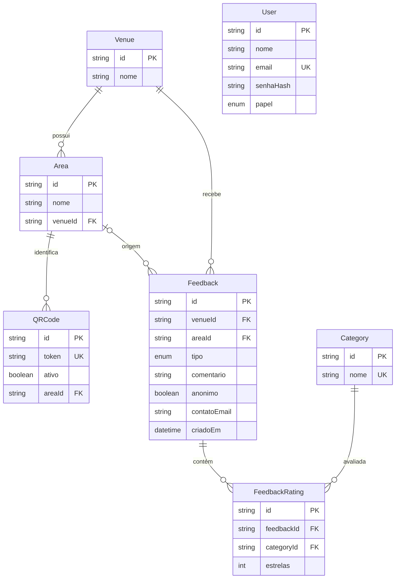

# Modelo de dados — MVP 1 (v1 · rascunho para revisão)

> Escopo: entidades necessárias para a entrega de **27/08** (feedback do cliente + login da gestão).
> Schema Prisma correspondente: [`api/prisma/schema.prisma`](../api/prisma/schema.prisma).
> Primeira versão para o time de Banco (Nicholas + Cauan) revisar com o backend no Bloco 1.

## Diagrama ER

## Entidades

| Entidade | Papel | Campos principais |
|---|---|---|
| **User** | Usuário de gestão que faz login | `nome`, `email` (único), `senhaHash`, `papel` |
| **Venue** | O restaurante | `nome` |
| **Area** | Mesa / área / setor do restaurante | `nome`, `venueId` |
| **QRCode** | QR físico que aponta para uma área | `token` (único), `ativo`, `areaId` |
| **Category** | Categoria avaliável | `nome` (ex.: Higiene, Atendimento, Alimento) |
| **Feedback** | Manifestação enviada pelo cliente | `tipo`, `comentario`, `anonimo`, `contatoEmail`, `venueId`, `areaId?`, `criadoEm` |
| **FeedbackRating** | Nota por categoria de um feedback | `estrelas` (1–5), `feedbackId`, `categoryId` |

## Enums
- **Papel:** `COORDENADOR` · `GERENTE` · `ADMINISTRADOR` *(Cliente não faz login)*
- **TipoFeedback:** `ELOGIO` · `SUGESTAO` · `RECLAMACAO`

## Decisões e observações
- **Anonimato por padrão:** `Feedback.anonimo = true`; `contatoEmail` só é usado quando o cliente opta por se identificar (LGPD).
- **Um feedback tem várias notas:** a relação `Feedback → FeedbackRating` permite avaliar **múltiplas categorias** de uma vez.
- **`Feedback.areaId` é opcional:** cobre o caso de um QR genérico (do restaurante, não de uma mesa específica).
- **Índice** em `Feedback(venueId, criadoEm)** para acelerar a listagem da gestão por data.
- **"Ocorrência" no MVP 1** = um `Feedback`. Status, tratativa e respostas prontas viram entidades próprias no **MVP 2**.

## Fora do escopo (MVP 2+)
`Occurrence` (com status/tratativa), `CannedResponse`, `AuditLog`, `Notification`, `Sector` (múltiplos setores por usuário) e políticas de retenção/anonimização automática.
