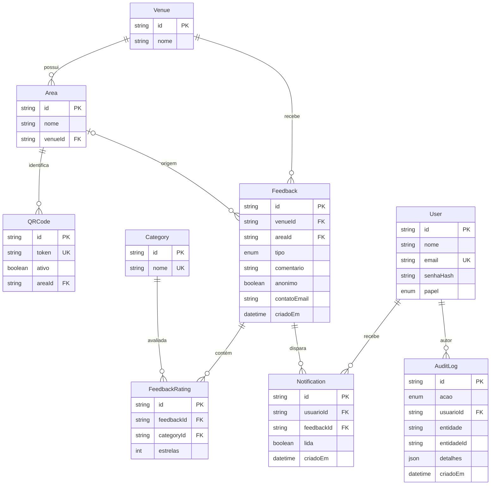

# Modelo de dados — MVP 1 (v1 · rascunho para revisão)

> Escopo: entidades necessárias para a entrega de **27/08** (feedback do cliente + login da gestão).
> Schema Prisma correspondente: [`api/prisma/schema.prisma`](../api/prisma/schema.prisma).
> Primeira versão para o time de Banco (Nicholas + Cauan) revisar com o backend no Bloco 1.

## Diagrama ER

```mermaid
erDiagram
    Venue    ||--o{ Area           : possui
    Area     ||--o{ QRCode         : identifica
    Venue    ||--o{ Feedback       : recebe
    Area     |o--o{ Feedback       : origem
    Feedback ||--o{ FeedbackRating : contém
    Category ||--o{ FeedbackRating : avaliada
    User     ||--o{ AuditLog       : autor
    User     ||--o{ Notification   : recebe
    Feedback ||--o{ Notification   : dispara
    Notification {
        string   id PK
        string   usuarioId FK
        string   feedbackId FK
        boolean  lida
        datetime criadoEm
    }
    AuditLog {
        string   id PK
        enum     acao
        string   usuarioId FK
        string   entidade
        string   entidadeId
        json     detalhes
        datetime criadoEm
    }
    User     {
        string id PK
        string nome
        string email UK
        string senhaHash
        enum   papel
    }
    Venue {
        string id PK
        string nome
    }
    Area {
        string id PK
        string nome
        string venueId FK
    }
    QRCode {
        string  id PK
        string  token UK
        boolean ativo
        string  areaId FK
    }
    Category {
        string id PK
        string nome UK
    }
    Feedback {
        string   id PK
        string   venueId FK
        string   areaId FK
        enum     tipo
        string   comentario
        boolean  anonimo
        string   contatoEmail
        datetime criadoEm
    }
    FeedbackRating {
        string id PK
        string feedbackId FK
        string categoryId FK
        int    estrelas
    }
```

## Entidades

| Entidade | Papel | Campos principais |
|---|---|---|
| **User** | Usuário de gestão que faz login | `nome`, `email` (único), `senhaHash`, `papel` |
| **Venue** | O restaurante | `nome` |
| **Area** | Mesa / área / setor do restaurante | `nome`, `ativo`, `venueId` — único por `(venueId, nome)` |
| **QRCode** | QR físico que aponta para uma área | `token` (único), `ativo`, `areaId` |
| **Category** | Categoria avaliável | `nome` (ex.: Higiene, Atendimento, Alimento) |
| **Feedback** | Manifestação enviada pelo cliente | `tipo`, `comentario`, `anonimo`, `contatoEmail`, `venueId`, `areaId?`, `criadoEm` |
| **FeedbackRating** | Nota por categoria de um feedback | `estrelas` (1–5), `feedbackId`, `categoryId` |
| **Notification** | Alerta de feedback novo para uma pessoa da gestão | `usuarioId`, `feedbackId`, `lida`, `criadoEm` — único por `(usuarioId, feedbackId)` |
| **AuditLog** | Quem fez o quê, sobre qual registro e quando | `acao`, `usuarioId`, `entidade`, `entidadeId`, `detalhes` (JSON), `criadoEm` |

## Enums
- **Papel:** `COORDENADOR` · `GERENTE` · `ADMINISTRADOR` *(Cliente não faz login)*
- **TipoFeedback:** `ELOGIO` · `SUGESTAO` · `RECLAMACAO`
- **AcaoAuditoria:** `LOGIN` · `SENHA_ALTERADA` · `SENHA_REDEFINIDA` · `USUARIO_CRIADO` · `USUARIO_EDITADO` ·
  `USUARIO_DESATIVADO` · `USUARIO_REATIVADO` · `AREA_CRIADA` · `AREA_RENOMEADA` · `AREA_DESATIVADA` ·
  `AREA_REATIVADA` · `QRCODE_GERADO` · `OCORRENCIA_STATUS`

## Decisões e observações
- **Anonimato por padrão:** `Feedback.anonimo = true`; `contatoEmail` só é usado quando o cliente opta por se identificar (LGPD).
- **Um feedback tem várias notas:** a relação `Feedback → FeedbackRating` permite avaliar **múltiplas categorias** de uma vez.
- **`Feedback.areaId` é opcional:** cobre o caso de um QR genérico (do restaurante, não de uma mesa específica).
- **Índice** em `Feedback(venueId, criadoEm)** para acelerar a listagem da gestão por data.
- **Nome da área é único dentro do restaurante** (`@@unique([venueId, nome])`): duas "Mesa 12" no mesmo
  lugar viravam duas barras indistinguíveis no dashboard. Entre restaurantes o nome pode repetir, porque
  toda casa tem a sua "Mesa 1". A constraint é por **texto exato** — quem for criar o `POST /areas` precisa
  aplicar `trim()` no nome, senão `"Mesa 1"` e `"Mesa 1 "` passam como áreas diferentes.
- **"Ocorrência" no MVP 1** = um `Feedback`. Status, tratativa e respostas prontas viram entidades próprias no **MVP 2**.

- **`AuditLog` só cresce.** Nenhuma rota edita ou apaga linha. `entidadeId` é texto sem chave
  estrangeira, de propósito: o registro precisa sobreviver ao alvo. E `detalhes` guarda o nome do alvo
  na hora da ação, para que renomear depois não reescreva o passado. É gravado na **mesma transação**
  da ação que registra. Ver `GET /api/audit` no [contrato](CONTRATO-API.md).

- **`Notification` é uma linha por destinatário**, não uma por feedback: cada pessoa tem o próprio
  "lida". Não guarda texto — a mensagem vem do feedback na leitura —, e por isso apaga em cascata com
  ele. Criada junto com o feedback para toda a gestão ativa; quem entra na equipe depois não herda
  alertas antigos.

## Fora do escopo (MVP 2+)
`Occurrence` (com status/tratativa), `CannedResponse`, `Sector` (múltiplos setores por usuário) e políticas de retenção/anonimização automática.
